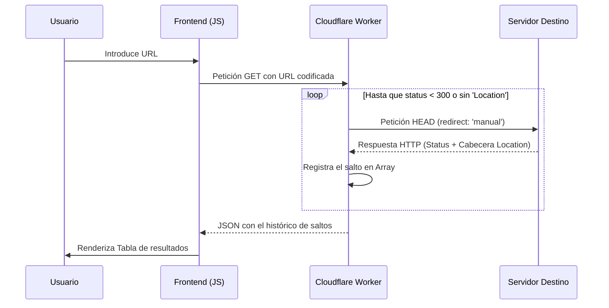

# 🚀 Rastreador de Redirecciones

[](https://developer.mozilla.org/en-US/docs/Web/HTML)
[](https://developer.mozilla.org/en-US/docs/Web/CSS)
[](https://developer.mozilla.org/en-US/docs/Web/JavaScript)
[](https://workers.cloudflare.com/)
[](https://rastreador-redirecciones.pages.dev)

Una herramienta web ligera y eficiente diseñada para analizar la cadena completa de redirecciones de cualquier URL. Ideal para tareas de SEO, depuración de enlaces y auditorías de seguridad.

---

## 📝 Descripción

El **Rastreador de Redirecciones** permite a los usuarios introducir una URL y visualizar paso a paso cada salto que realiza el servidor hasta llegar al destino final. La aplicación desglosa los códigos de estado HTTP (301, 302, etc.) y las direcciones intermedias, presentando la información de forma visualmente categorizada por colores según el tipo de respuesta.

---

## ✨ Funcionalidades

* **Rastreo Recursivo:** Sigue automáticamente la cadena de redirecciones hasta el destino final.
* **Identificación de Estados:** Clasificación visual mediante colores para estados exitosos (2xx), redirecciones (3xx), errores de cliente (4xx) y errores de servidor (5xx).
* **Soporte CORS:** Implementado a través de un Cloudflare Worker para evitar bloqueos del navegador al consultar sitios externos.
* **Diseño Responsivo:** Interfaz optimizada para su uso en dispositivos móviles y de escritorio.
* **Gestión de URLs Relativas:** Capacidad de resolver rutas relativas en las cabeceras `location`.

## 🛠️ Stack Tecnológico

* **Frontend:** HTML5, CSS3 (Variables nativas, Flexbox), JavaScript Vanilla (ES6+).
* **Backend (Serverless):** [Cloudflare Workers](https://workers.cloudflare.com/) para el procesamiento de peticiones HTTP.
* **Fuentes:** Google Fonts (Plus Jakarta Sans).

---

## ⚙️ Enfoque Técnico

Para superar las limitaciones de seguridad de los navegadores (CORS) y el comportamiento por defecto de `fetch()` (que suele seguir las redirecciones automáticamente de forma invisible para el usuario), el proyecto utiliza el siguiente flujo:

### Diagrama de Flujo



> [!IMPORTANT]
> **Estrategia Manual:** En el Worker, se utiliza la opción `{ redirect: 'manual' }`. Esto permite interceptar el código 301/302 y extraer la cabecera `location` manualmente antes de decidir si continuar al siguiente salto.

---

## 📂 Estructura del Proyecto

```
.
├── index.html          # Interfaz de usuario principal
├── style.css           # Estilos y diseño responsivo
├── script.js           # Lógica del cliente y manipulación del DOM
├── worker.js           # Lógica del Cloudflare Worker (backend)
├── wrangler.json       # Configuración de despliegue para Cloudflare
├── package.json        # Metadatos del proyecto
└── README.md           # Documentación (este archivo)
```

--- 

## 🚀 Instalación y Despliegue

1. Clonar y forkear el repositorio:

 ```bash
 git clone https://github.com/Jaldekoa/rastreador-redirecciones.git
 ```

 2. Crear y configurar un worker en [Cloudflare Workers](https://workers.cloudflare.com/):

    - Copiándo y pegando el código del archivo `worker.js` en un nuevo Worker de Cloudflare ó

    -  Primero conecte su fork del repositorio, cambie el `name` del archivo `wrangler.json` por el nombre de su Worker, deje vacío el comando de compilación, deje como `/` el directorio raíz de su repositorio del fork y use `exit 0` como comando de implementación. 

3. Actualizar el Frontend:

En `script.js`, cambia la constante `WORKER_URL` por la URL generada por tu despliegue en Cloudflare.

---

## 👤 Autor
[](https://github.com/Jaldekoa)
